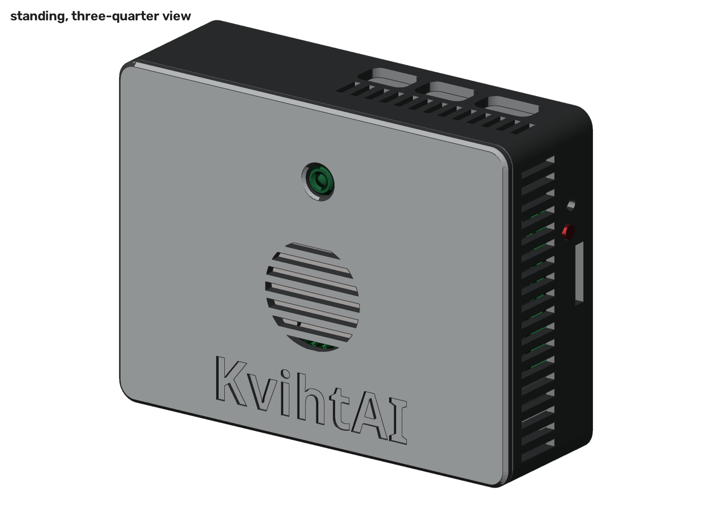
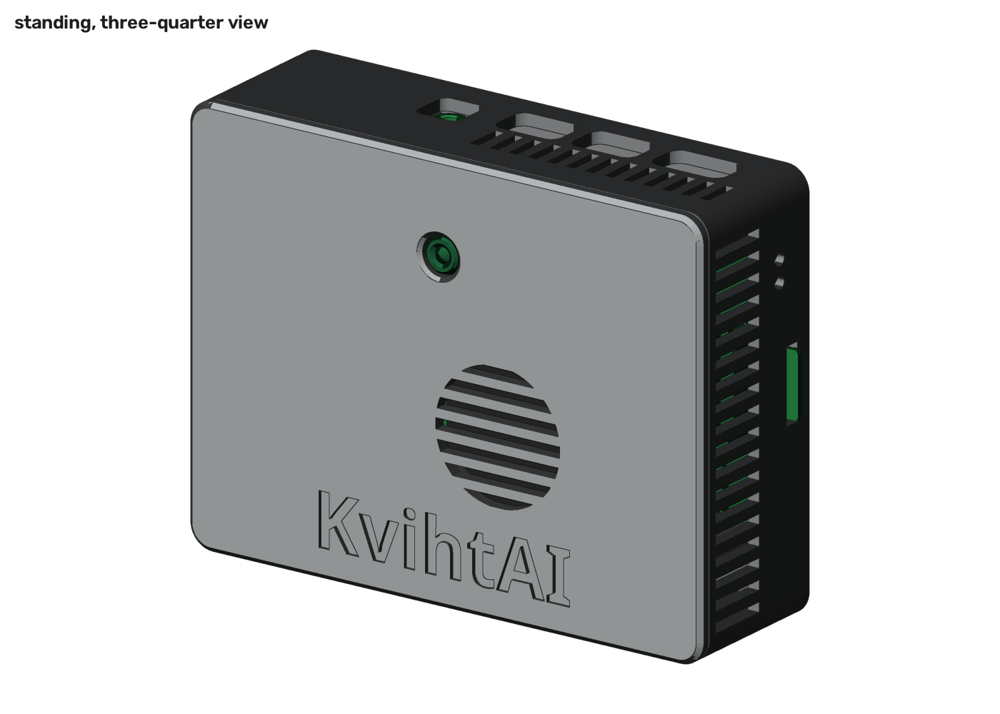

# Camera enclosure

A 3D-printed enclosure that holds a Raspberry Pi and a Raspberry Pi Camera
Module 3 in one box. The same script builds it for two boards:

- **Raspberry Pi 5** with the official Active Cooler, in `out/pi5/`.
- **Raspberry Pi 4 Model B** with the fan from the Raspberry Pi 4 Case Fan, in
  `out/pi4b/`.

Both are built in FreeCAD from a Python script, checked against STEP models of
the board and the camera, and printed without supports on a Prusa Core One with
a 0.4 mm nozzle.

| Pi 5 | Pi 4 Model B |
| --- | --- |
|  |  |

## How it is used

The box stands on its GPIO side, on the table or on a tripod. The lens looks out
of the large front face. In this position the camera's long image axis is
vertical, so the image is portrait, which suits a lifter filmed from the side.

`rpicam` can only rotate by 0 or 180 degrees, so the 90 degree turn to portrait
is done in software, for example `cv2.rotate`. The mount fixes the rotation, so
it is a constant. Check its direction once with a test frame. The Pi 4 version
holds the camera the other way round (see the camera cable note), so its turn
goes the other way from the Pi 5 version's.

Outside size, wide x tall x deep when standing: 91 x 69.5 x 29.7 mm for the
Pi 5, 91 x 69.5 x 28.3 mm for the Pi 4.

| Side, when standing | Pi 5 | Pi 4 Model B |
| --- | --- | --- |
| Front | Lens, fan intake grille, name | Lens, fan intake grille, name |
| Top | USB-C power, both micro-HDMI, vent slots | USB-C power, both micro-HDMI, audio jack, vent slots |
| Bottom | 1/4"-20 tripod nut | 1/4"-20 tripod nut |
| Left, seen from the front, top to bottom | Ethernet, USB 3.0, USB 2.0 | USB 2.0, USB 3.0, Ethernet |
| Right, seen from the front | microSD, power button, status LED, blower exhaust slots | microSD, power and activity LEDs, vent slots |
| Back | Four screw heads, vent slots under the board | Four screw heads, vent slots under the board |

## Parts

### Pi 5

| Qty | Part | Notes |
| --- | --- | --- |
| 1 | Raspberry Pi 5 | |
| 1 | Raspberry Pi Active Cooler | Expected. The lid height and the vents are designed round it. |
| 1 | Raspberry Pi Camera Module 3, standard lens | For the wide lens, build with `KVIHTAI_CAMERA=wide`. |
| 1 | Pi Zero camera cable, 38 mm | 22-way 0.5 mm pitch to 15-way 1 mm pitch. See the note below. |
| 4 | M2.5 x 12 socket head screw, DIN 912 | Hold the Pi and close the box. 10 to 16 mm also fits. |
| 4 | M2 x 5 or M2 x 6 screw | Hold the camera. Not longer than 6 mm, or it comes out of the front face. |
| 1 | 1/4"-20 UNC hex nut | 11.1 mm across flats, the standard tripod thread. |

**Camera cable.** The camera sits right above the Pi's camera connector, so the
cable is short and does not fold. The design is checked for a 38 mm cable,
which lies in a small loop up towards the lid. The 200 mm cable that comes with
the Camera Module 3 for the Pi 5 does not fit neatly. Other short lengths are
not checked.

### Pi 4 Model B

| Qty | Part | Notes |
| --- | --- | --- |
| 1 | Raspberry Pi 4 Model B | |
| 1 | Fan from the Raspberry Pi 4 Case Fan | Taken out of its clear housing. 25 x 25 x 6 mm. See the cooling note below. |
| 1 | Raspberry Pi Camera Module 3, standard lens | For the wide lens, build with `KVIHTAI_CAMERA=wide`. |
| 1 | Camera cable, 100 mm, 15-way 1 mm pitch at both ends | The contacts must be on the same side at both ends. See the note below. |
| 4 | M2.5 x 12 socket head screw, DIN 912 | Hold the Pi and close the box. 10 to 16 mm also fits. |
| 4 | M2 x 5 or M2 x 6 screw | Hold the camera. Not longer than 6 mm, or it comes out of the front face. |
| 4 | M2 x 8 screw | Hold the fan, through its corner holes. Not longer than 10 mm. |
| 1 | 1/4"-20 UNC hex nut | 11.1 mm across flats, the standard tripod thread. |

**Camera cable.** The Pi 4 takes the cable with its contacts facing the
micro-HDMI sockets, and the camera takes it with its contacts facing the camera
board. A flat cable cannot twist on the way between them, so which way round
the camera has to sit depends on the cable. This version is built for a cable
whose contacts are on the same side at both ends: looking at one face of the
cable, you see both blue stiffeners. The camera then sits with its connector
towards the microSD end, and the cable leaves it that way, runs under the lid
to that end, turns down and comes back above the board to the Pi's connector.

A cable with the contacts on opposite sides would need the camera turned round,
and the 100 mm of cable would have no room to go that way. That is not
supported.

The modelled cable path is 88 mm, counting the ends inside both connectors,
against 100 mm of cable. The rest makes the loop rounder; there is room for it
between the lid and the board. Other lengths are not checked.

**Cooling.** The Pi 4 slows its CPU at 80 °C. In Jeff Geerling's test of the
Case Fan, a Pi 4 under a 20-minute CPU stress test started to throttle after
about 9 minutes without the fan, and not at all with it. The live tracker needs
13 to 23 ms a frame on the Pi 4 against 12.5 ms between frames at 80 fps (see
`docs/DESIGN.md`), so the Pi 4 has no headroom, and throttling costs frames. A
two-hour training session is far longer than it takes to heat up. The fan sits
in the lid over the SoC and the memory. It draws air in through the grille in
the front face and blows it onto the board, and the air leaves through the vent
slots.

The 18 x 18 x 10 mm heatsink that comes with the Case Fan does not fit under
the fan. A heatsink up to 6 mm tall would, but with the fan it is not needed.

The fan is switched by GPIO 14. Add this line to `/boot/firmware/config.txt`,
which turns it on at 60 °C:

```
dtoverlay=gpio-fan,gpiopin=14,temp=60000
```

GPIO 14 is also the serial console's transmit pin, so the serial console must
be off.

## Printing

Open `out/pi5/print/enclosure.3mf` or `out/pi4b/print/enclosure.3mf` in
PrusaSlicer. Each holds all the parts on one plate, already turned the way they
print, with the settings they need stored per part. Select these profiles,
slice, and print:

- Printer: Prusa CORE One HF0.4 nozzle.
- Print: `0.20mm STRUCTURAL @COREONE 0.4`.
- Filament: `Prusament PETG @COREONE HF0.4`, or another PETG. PLA is not
  recommended next to a warm Pi.

PrusaSlicer 2.9 estimates, with those profiles:

| Board | Part | Lies on | Time alone | Filament |
| --- | --- | --- | --- | --- |
| Pi 5 | Base | its back | 1 h 42 min | 30.8 g |
| Pi 5 | Lid | its front face | 52 min | 18.2 g |
| Pi 5 | Button pin | its collar | 1 min | 0.1 g |
| Pi 5 | Whole plate | | 2 h 29 min | 49.0 g |
| Pi 4 | Base | its back | 1 h 38 min | 29.2 g |
| Pi 4 | Lid | its front face | 52 min | 18.1 g |
| Pi 4 | Whole plate | | 2 h 24 min | 47.3 g |

The settings stored in the project, if you slice the single STLs in
`out/<board>/print/` instead:

- Perimeters: 3.
- Bottom solid layers: 5. The back and the front face are 2 mm thick. With the
  profile's 4 layers, the slicer leaves one layer of sparse infill in them.
- Supports: off. Nothing needs them.
- Lid only, bridging angle 90 degrees. The first layers above the engraved name
  are bridges. At 90 degrees they cross the letters in short spans; at the
  default angle PrusaSlicer warns about long bridges there.

The lid prints on its front face, so the face takes the texture of the sheet.
A satin or textured sheet gives the best-looking front.

Details that let it print without supports:

- Every small horizontal hole (LED windows, power button, tripod thread) is a
  teardrop with a 45 degree roof. The port openings are bridged.
- The counterbores for the screw heads have two sacrificial bridge layers.
  After printing, push a screw through to break them if they did not open.
- The vent slots in the side walls are vertical when printing.
- The outer edges on the bed are chamfered, which stops elephant's foot from
  showing.

## Assembly

### Pi 5

1. Fit the Active Cooler to the Pi 5 and plug in its fan. Route the fan cable
   round the lid post at the mounting hole between the GPIO header and the USB
   ports, not over it.
2. Drop the 1/4"-20 nut into the slot in the block on the GPIO-side wall.
3. Put the button pin into its hole in the short wall at the microSD end, from
   the inside, collar inwards. Hold it with a finger or a piece of tape.
4. Plug the 22-way end of the cable into CAM/DISP 0, contacts facing the
   Ethernet jack.
5. Lower the Pi into the base, USB and Ethernet end first and tilted, so the
   ports go into their openings. Then lower the other end flat onto the four
   standoffs. The Pi now holds the button pin in place.
6. Screw the camera onto the four standoffs inside the lid with the M2 screws,
   lens through the round opening.
7. Plug the 15-way end of the cable into the camera, contacts facing the camera
   board. The lid opens about 70 degrees on the cable, hinged along the port
   side, which is enough to reach the connector latch.
8. Close the lid. Its lip goes inside the walls, and a tab on the lid rests on
   the tripod nut.
9. Turn the box over and fit the four M2.5 screws from the back. They pass
   through the base and the Pi and cut into the posts of the lid. Tighten
   gently; the lid clamps the Pi against the standoffs.

### Pi 4 Model B

1. Take the fan out of the Case Fan's clear housing. Screw it onto the four
   posts inside the lid with the M2 x 8 screws through its corner holes, label
   facing away from the lid, the way it sits in the official case. It then
   draws air in through the grille.
2. Drop the 1/4"-20 nut into the slot in the block on the GPIO-side wall.
3. Plug one end of the cable into the Pi's camera connector, between the
   micro-HDMI sockets and the audio jack, contacts facing the micro-HDMI
   sockets.
4. Lower the Pi into the base, USB and Ethernet end first and tilted, so the
   ports go into their openings. Then lower the other end flat onto the four
   standoffs.
5. Screw the camera onto the four standoffs inside the lid with the M2 x 5 or
   M2 x 6 screws, lens through the round opening. Its connector is then
   towards the microSD end.
6. Plug the other end of the cable into the camera, contacts facing the camera
   board.
7. Push the fan leads onto the GPIO header: red on pin 4, black on pin 6, blue
   on pin 8. Pins 4, 6 and 8 are the second, third and fourth pins of the row
   along the board edge, counted from the microSD end.
8. Close the lid, with the cable in a loop towards the microSD end: from the
   camera along under the lid, down at that end and back above the board. The
   lid's lip goes inside the walls, and a tab on the lid rests on the tripod
   nut.
9. Turn the box over and fit the four M2.5 screws from the back. They pass
   through the base and the Pi and cut into the posts of the lid. Tighten
   gently; the lid clamps the Pi against the standoffs.

## Checks

`check.py` loads STEP models of the board and of the Camera Module 3 and tests
the printed parts against them. With the current parameters, for both boards:

- No overlap between any printed part and the Pi, the camera, the cooler or
  fan, or the camera cable. The cable, outside the two connectors it plugs
  into, is also checked against the Pi, the camera and the cooler or fan.
- Nothing in the base reaches over the outline of the Pi, so the Pi can be
  lowered in.

Smallest gaps, from `out/<board>/check/report.json`.

Pi 5:

| Between | Gap | Where |
| --- | --- | --- |
| Lid post and cooler push-pin cap | 0.45 mm | mounting hole by the USB-C connector |
| Lid and Pi components | 0.83 mm | same post |
| Camera connector and cooler | 0.41 mm | over the blower |
| Camera cable and lid | 0.36 mm | top of the cable loop |
| Camera cable and cooler | 1.19 mm | where the cable comes down past the blower |
| Button pin and Pi power button | 0.25 mm | free play before the pin presses |
| Standoffs and Pi board | 0.03 mm | the board rests on the standoffs |

The modelled cable path is 35 mm, counting the ends inside both connectors,
against 38 mm of cable, so the cable is not pulled tight.

Pi 4 Model B:

| Between | Gap | Where |
| --- | --- | --- |
| Lid lip and USB 3.0 stack | 0.45 mm | notch in the lip over the stack |
| Camera and fan | 0.70 mm | edge of the camera board next to the fan |
| Camera cable and lid | 0.27 mm | top of the cable loop |
| Camera cable and Pi components | 0.91 mm | over the USB-C socket |
| Camera cable and camera | 1.14 mm | under the camera's cable connector |
| Fan and GPIO pins | 1.46 mm | corner of the fan next to the header |
| Fan leads and lid | 2.0 mm | room for the leads to bend over |
| Standoffs and Pi board | 0 mm | the board rests on the pads round its mounting holes |

The fan is 7.3 mm above the SoC.

The Pi 4 model is not Raspberry Pi's, which publishes none for the Pi 4. It is
the one on [step.parts](https://www.step.parts/parts/raspberry_pi_4_model_b),
and it agrees with Raspberry Pi's mechanical drawing on every part the
enclosure is built round: each is where the drawing puts it, and as tall or
within 0.1 mm of it, except the USB 2.0 stack, which is 0.4 mm lower. The
enclosure uses the taller of the two. Its micro-HDMI sockets and
one USB stack are open surfaces, which cannot be tested for overlap, so the
check replaces each with its bounding box. The power and activity LEDs are not
in the model; their windows are placed from the drawing.

The wide-lens builds are only checked for valid geometry. Raspberry Pi's STEP
model is of the standard lens, so the wide lens is not tested against the lid.

Renders and cross-sections are in `out/<board>/render/`.

## Limits

- The Active Cooler is not in Raspberry Pi's STEP model. It is modelled as an
  envelope from its mechanical drawing, with every height taken as an upper
  bound.
- The Case Fan's fan is modelled as a 25 x 25 x 6 mm block, the size given in
  [Raspberry Pi's product brief](https://datasheets.raspberrypi.com/case-fan/case-fan-product-brief.pdf)
  and [Jeff Geerling's review](https://www.jeffgeerling.com/blog/2020/raspberry-pi-4-has-fan-now-case-fan/).
  Its corner holes are taken to be on a 20 mm square, the usual spacing for a
  25 mm fan. None of this is measured. The fan leads' Dupont housings are
  taken as 14 mm tall, and they set the height of the Pi 4 lid.
- The Pi 4's temperature in the box with the fan has not been measured.
- The camera cable is modelled as a path, not simulated. Its real shape
  depends on how it is folded in.
- Hole sizes assume PETG on a Core One. Other printers or materials may need
  the pilot holes in `enclosure.py` opened up or closed down by 0.1 mm.
- Nothing here has been printed yet.

## Rebuilding

The design is `enclosure.py`. The dimensions shared by both boards are in
`Params`, and the ones that differ are in `BOARD_PARAMS`. Every
script builds the Pi 5 version unless `KVIHTAI_BOARD=pi4b` is set.

```sh
freecad.cmd build.py                      # writes out/pi5/*.step, out/pi5/enclosure.FCStd, out/pi5/print/
KVIHTAI_BOARD=pi4b freecad.cmd build.py   # the same for the Pi 4, in out/pi4b/
freecad.cmd check.py                      # downloads the models into ref/ on first run
python render.py                          # needs numpy and opencv, writes out/pi5/render/*.png
```

`KVIHTAI_CAMERA=wide freecad.cmd build.py` builds the lid for the wide-angle
camera, 1.2 mm deeper. The STEP files in `out/<board>/` hold the parts in their
assembled position for use in other CAD programs.
